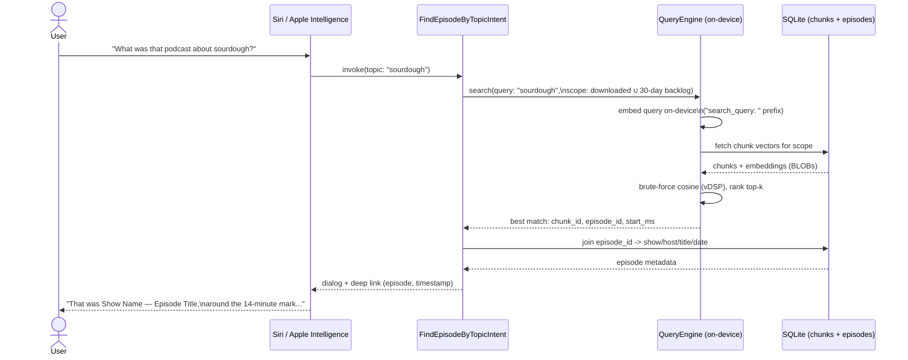
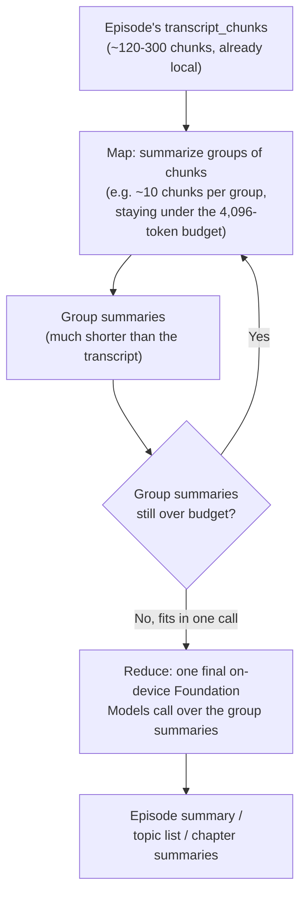

# Feature roadmap

Extensions worth designing for now, even if not all ship in v1. The first six are a natural fit for the architecture in [PROPOSAL.md](PROPOSAL.md) rather than a bolt-on, because the expensive work (chunking, embedding) already happens once on the farm and the client already does a flat scan over whatever chunks it has locally. Adding more chunks, or chunks with richer metadata, doesn't change the mechanism — it just changes what's in the table. The last three (7–9) go further — generation instead of retrieval, and a genuinely server-side search system — and are called out as such rather than presented as free additions.

## 1–2. Single-episode and cross-episode (on-device) search

Already the core of the design in [PROPOSAL.md](PROPOSAL.md) — restated here only to place them at the front of the roadmap, since everything else in this list is additive to these two.

## 3. "Show Notes" as a second, complementary index

Most podcast feeds carry "Show Notes" (RSS `<description>`/`<content:encoded>`) — episode summary, guest bio, links, timestamps the host wrote themselves. That's often *higher-signal* than the transcript for "what was this episode about," and it's usually already available wherever the app currently ingests the RSS feed, no new data source needed.

- Chunk and embed "Show Notes" through the exact same farm pipeline as transcripts (same model, same `"search_document: "` prefix), tagged with a `source_type` so client-side ranking/display can distinguish "found in the Show Notes" from "found at 14:32 in the transcript."
- "Show Notes" are typically short (a paragraph to a few hundred words) — often one or two chunks per episode, negligible added payload size compared to a full transcript's worth of chunks.
- Falls back cleanly when a feed doesn't provide "Show Notes": no show-notes chunks for that episode, transcript search still works, nothing breaks.

## 4. 30-day searchable backlog for listened episodes

Right now chunk retention is tied to *audio* retention — delete the downloaded audio, delete its chunks. That's the right default for storage-bounded cross-episode search, but it creates a real gap: a user often deletes an episode's audio right after finishing it (that's the normal listening lifecycle), yet a week later remembers a topic from it and wants to find it. If chunks were evicted with the audio, that episode is now unsearchable — exactly the case Siri-based recall (below) needs to *not* fail.

The fix: decouple chunk/text retention from audio retention specifically for episodes the user has *finished listening to*. Track a `listened_at` timestamp per episode (the app already knows this for playback-position/completion purposes) and keep that episode's chunks — text and embeddings only, not audio — for 30 days after `listened_at`, independent of whether the audio file itself is still on disk. This is cheap to justify: a chunk is ~1.5KB of embedding plus a sentence or two of text; even a heavy listener finishing a few episodes a day for 30 days is a few hundred KB to a few MB total, nothing close to what one episode's audio file costs. A daily prune job deletes chunk rows where `listened_at < now - 30 days` (and the episode isn't otherwise downloaded/kept, which has its own retention).

## 5. Siri / App Intents integration — "what was that podcast about X?"

This is the feature the other four are really in service of, and it's also why the whole design being **on-device and offline** matters rather than being a nice property: an App Intent that Siri/Apple Intelligence can invoke has to answer without a network round-trip, within a tight execution budget, and works even when the app isn't in the foreground. A server round-trip per query would be a poor fit here in a way it wouldn't be for a normal in-app search bar. The brute-force cosine scan already designed in [PROPOSAL.md](PROPOSAL.md) (sub-millisecond to low-single-digit milliseconds) comfortably fits that budget; a network call would not.

Concretely, using Apple's App Intents framework:

- Define an `AppEntity` for a podcast episode (show name, episode title, hosts, published date, episode artwork) — this is the metadata piece from item 6 below, surfaced through Siri results and Spotlight for free once it exists as a proper entity type.
- Define an intent (e.g. `FindEpisodeByTopicIntent`) taking a free-text topic parameter, backed by the same `QueryEngine.search`/`searchLibrary` mechanism already in `client-sample/QueryEngine.swift` — the intent handler is a thin wrapper, not new search logic.
- Search scope for the intent should be the union of "currently downloaded/kept" and the "30-day listened backlog" from item 4 — Siri is disproportionately likely to be asked about something the user *just* finished listening to and already deleted, which is exactly the gap item 4 closes.
- Response: a natural-language dialog response ("That was **Show Name** — *Episode Title*, from **Sept 3** — around the 14-minute mark, the host and **Guest Name** were talking about...") plus a deep link that opens the app to that timestamp. The dialog text is assembled from the episode metadata entity + the matched chunk's text/timestamp, not generated by the embedding model itself — the embedding step only finds *which* chunk is relevant, the metadata join produces the human-readable answer.

No step in this flow leaves the device — the whole path from query to answer is local, which is what keeps it within a Siri intent's execution budget and working offline.

See [PLATFORM_COMPATIBILITY.md](PLATFORM_COMPATIBILITY.md) for how iOS 27's App Intents "Assistant Schemas" directly power this feature, and the minimum iOS version / Apple Intelligence hardware it actually requires.

## 6. Show/host/date metadata in the index

For both ranking quality and for the Siri use case above to produce a sensible answer, every chunk needs to resolve back to rich episode metadata, not just an opaque `episode_id`: show name, host name(s), episode title, published date, and (if useful) episode-level tags/category from the feed. This shouldn't be duplicated into `transcript_chunks` — it almost certainly already lives in whatever `episodes`/`shows` tables the app's existing SQLite schema has for its normal library UI. `transcript_chunks.episode_id` is the join key; the search layer joins out to that existing metadata table when assembling a result, rather than this design inventing a second copy of show/episode data.

One thing worth deciding explicitly: whether to *also* embed a small "episode identity" pseudo-chunk (show name + host + title + date, concatenated) alongside the transcript/show-notes chunks. That helps a query like "that show hosted by X" or "the episode from last week" match on metadata terms the transcript itself may never say aloud — hosts rarely introduce themselves mid-episode. Cheap to add (one extra chunk per episode) and closes a real gap between "search the content" and "search what the episode *is*."

## 7. Siri generative Q&A over an episode — "summarize today's ATP episode," "what are the topics," "1–2 sentence chapter summaries"

These three are one feature, not three: each is an App Intent that (a) resolves "today's ATP episode" to a specific `episode_id`, then (b) hands the transcript to the on-device Foundation Models framework to *generate* an answer, rather than retrieve one. This is a different capability from feature 5's `FindEpisodeByTopicIntent` — that intent finds *which chunk* matches a query (retrieval, via `nomic-embed-text` + cosine similarity); this one produces new text *about* an episode the user already named (generation, via Apple's on-device LLM). Both are exposed as App Intents so Siri can invoke either, but they're backed by genuinely different mechanisms and are worth keeping conceptually distinct in the implementation, not merged into one intent.

**Step 1 — resolving "today's ATP episode":** a new intent parameter type, not a topic string. Needs fuzzy show-name matching ("ATP" → the show's canonical ID among the user's subscriptions) and "most recent episode published for that show." Both resolve against the `episodes`/`shows` metadata tables already established in feature 6 — no new data source, just a different query shape (`WHERE show_id = ? ORDER BY published_at DESC LIMIT 1` instead of a topic search).

**Step 2 — the context-window constraint that actually shapes this feature, and two ways to handle it:** Apple's **on-device** Foundation Models `SystemLanguageModel` has a **hard 4,096-token context limit** — fixed, not configurable, confirmed unchanged in iOS 27, and the framework throws `.exceededContextWindowSize` if exceeded. A 2-hour episode's transcript runs **~24,000–30,000 tokens** (per NOMIC_EMBED.md's earlier estimate) — roughly 6–7x over budget. Feeding a whole episode transcript to the on-device model in one call is not an option. Two real ways to handle that, with a real tradeoff between them:

**Option A — chunk the transcript into segments that each fit the budget, summarize in stages (map-reduce), stay fully on-device:**

- This reuses the transcript chunks that already exist locally for search — no new data pulled, no new farm-side work. The map step is just N Foundation Models calls over existing local text (grouped to fit the 4,096-token window) instead of one impossible call over all of it.
- The three different Siri phrasings share this pipeline, differing only in the final reduce-step prompt: "summarize the episode" (one paragraph), "what are the topics" (a list), "summarize each chapter in 1–2 sentences" (reduce scoped per-chapter instead of per-episode — see feature 8 for where chapter boundaries come from).
- Stays fully on-device and offline — consistent with every other feature in this design. The cost is latency: N+1 sequential on-device LLM calls instead of feature 5's single brute-force scan (sub-millisecond). Worth setting Siri's expectations accordingly (a short "thinking" state is normal here) and checking this against Apple's execution-time budget for a Siri-invoked intent specifically, since a multi-call map-reduce could be tight.

**Option B — route to Apple's Private Cloud Compute (PCC) instead, new as of WWDC 2026:** the Foundation Models framework now offers a server-hosted variant of Apple's own model running on Private Cloud Compute, with a **32,000-token context window** — a one-line configuration change in the same API (not a different framework or a third-party service). A 2-hour transcript (~24,000–30,000 tokens) plus prompt overhead is close to PCC's ceiling but plausibly fits in a **single call**, skipping map-reduce entirely for most episodes (very long ones — 3+ hours — would still need at least light splitting). This is architecturally much simpler than Option A, but it's a real, deliberate tradeoff, not a strictly-better upgrade: it requires network connectivity, sends the transcript to Apple's infrastructure (Private Cloud Compute specifically — Apple's own confidential-compute environment, not a third-party API, so this doesn't reintroduce a third-party dependency the way it might first sound, but it's still not on-device), and breaks the fully-offline property every other feature in this design deliberately preserves.

**Recommendation:** start with Option A to keep this feature consistent with the rest of the design's offline-first posture, and treat Option B as a worthwhile fallback specifically for episodes long enough that Option A's map-reduce round count gets unwieldy (very long-form shows), or if Siri's execution-time budget turns out too tight for N sequential on-device calls. Worth confirming Apple's current terms for PCC usage volume/rate limits from an app before depending on it as a first-class path rather than a fallback.

**Sources:** [TN3193: Managing the on-device foundation model's context window — Apple Developer](https://developer.apple.com/documentation/technotes/tn3193-managing-the-on-device-foundation-model-s-context-window), [Making the most of Apple Foundation Models: Context Window](https://zats.io/blog/making-the-most-of-apple-foundation-models-context-window/), [Build with the new Apple Foundation Model on Private Cloud Compute — WWDC26](https://developer.apple.com/videos/play/wwdc2026/319/), [WWDC 2026 — Apple's new server LLM on Private Cloud Compute — dev.to](https://dev.to/arshtechpro/wwdc-2026-apples-new-server-llm-on-private-cloud-compute-whats-in-it-for-developers-2edd)

## 8. Auto-generated chapters for podcasts without them

Many podcasts already ship chapters in-feed via the Podcasting 2.0 `<podcast:chapters>` tag or the older Podlove Simple Chapters (PSC) format — when present, use those directly, same "falls back cleanly" pattern as feature 3's show notes: no work needed, no auto-generation, just display what the feed already provides. This feature is specifically for episodes/shows that don't provide either.

**Where this runs — the farm, not the client, for the same reason everything else does:** chapter detection is compute-heavy (topic segmentation + title generation across a full transcript) and the result is identical for every listener of that episode, so it fits the "transcribe once, compute once, share many times" economics this whole design is built around. Doing it per-device would be wasteful and slower.

**Mechanism, reusing infrastructure that already exists rather than building a separate pipeline:**

1. **Boundary detection from embeddings already computed for search.** A well-known technique: compute cosine similarity between *consecutive* chunk embeddings (already sitting in the farm's output from the chunk+embed step); a sharp drop in similarity between adjacent chunks is a candidate topic boundary. No new embedding work — this is a read over data the farm already produces for feature 1/2's search.
2. **Title generation per detected segment.** For each candidate chapter (a run of chunks between two boundaries), generate a short title from that segment's text. Farm-side, so — unlike feature 7's on-device 4,096-token ceiling — there's no equivalent hard constraint forcing map-reduce here; a single chapter segment's text is much shorter than a whole episode, and the farm can use whatever on-device model capacity it has (the same MLX-hosted setup already standing up chunk embedding) or a larger model if chapter-title quality warrants it, since this runs once per episode, not per query.
3. **Output:** a chapter list (`title`, `start_ms`) shipped in the sync payload alongside the transcript/chunks — the client never runs chapter detection, only displays whatever chapters (native or auto-generated) arrived with the episode.

This chapter list is also the natural input to feature 7's "summarize the chapters" variant — chapter boundaries give the reduce step natural, meaningful groupings instead of arbitrary chunk-count buckets.

## 9. Server-based semantic search across the podcast catalog (enhances discovery, distinct from personal search)

Worth being precise about what this is *not*: it's not an enhancement to features 1/2/5's on-device search — those search **the user's own already-synced content** (episodes downloaded or in the 30-day listened backlog). This is a different, complementary capability: searching **the whole podcast catalog** — shows and episodes the user hasn't listened to, doesn't have transcripts for locally, and couldn't fit on-device even if they wanted to — for podcast *discovery* ("find me an episode about X across everything," "look up a podcast that covers Y"), not personal recall.

**Why this one has to be server-side, when the rest of this design goes out of its way not to be:** the corpus is the entire catalog, not one user's library — far too large to sync to a phone, and there's no "download it first" step the way personal search has. This is the one place in the whole design where a per-query server round-trip is the right call, not a compromise — it's simply a different feature with a different shape, not a violation of the "no per-query server cost" principle established for personal search (that principle was always scoped to *searching content already on the device*).

**What's actually new here vs. what's reused:** less than it might look like. The farm already computes `nomic-embed-text-v1.5` chunk embeddings for every episode as part of features 1–4 — this feature is substantially "expose a query API over embeddings the farm already produces," not a second embedding pipeline:

- **Query-time embedding** happens server-side, using the exact same MLX embedding call already standing up chunk embedding on the farm (see server-sample/ChunkAndEmbed.swift) — applied to the incoming search query instead of a transcript chunk. No new model, no new runtime.
- **Search mechanism at catalog scale** is the same brute-force-vs-index question already worked through for the client in PROPOSAL.md's "How far does brute force scale?" — just at a much larger N. A single show's or a modest catalog's chunks might still be brute-forceable server-side (GPUs, not power-constrained); a large multi-show catalog almost certainly needs a real index at this scale (e.g. a server-side vector index/database — `pgvector`, a managed vector search service, or similar), which is a reasonable choice here in a way it deliberately wasn't for the client, since none of the "don't touch the client's SQLite" or "no cross-compiled extension for iOS" constraints apply to backend infrastructure.
- **Ranking quality:** same retrieval-tuned model, same `"search_query: "`/`"search_document: "` prefix convention — a query that works well against the user's personal library should work comparably well against the catalog, since it's the same embedding space.

This is meaningfully more infrastructure than any other item on this roadmap — a real query API, request-time server load proportional to usage, and (at real catalog scale) a production vector index to stand up and operate — so it's reasonable to treat this as the most significant "v2 and beyond" item here rather than something to build alongside the core on-device feature.
