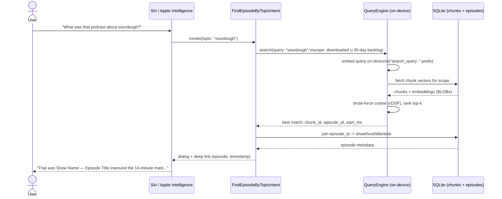

# Feature roadmap

Six extensions worth designing for now, even if not all ship in v1 — each is a natural fit for the architecture in [PROPOSAL.md](PROPOSAL.md) rather than a bolt-on, because the expensive work (chunking, embedding) already happens once on the farm and the client already does a flat scan over whatever chunks it has locally. Adding more chunks, or chunks with richer metadata, doesn't change the mechanism — it just changes what's in the table.

## 1–2. Single-episode and cross-episode (on-device) search

Already the core of the design in [PROPOSAL.md](PROPOSAL.md) — restated here only to place them at the front of the roadmap, since everything else in this list is additive to these two.

## 3. "Show Notes" as a second, complementary index

Most podcast feeds carry "Show Notes" (RSS `<description>`/`<content:encoded>`) — episode summary, guest bio, links, timestamps the host wrote themselves. That's often *higher-signal* than the transcript for "what was this episode about," and it's usually already available wherever the app currently ingests the RSS feed, no new data source needed.

- Chunk and embed "Show Notes" through the exact same farm pipeline as transcripts (same model, same `"search_document: "` prefix), tagged with a `source_type` so client-side ranking/display can distinguish "found in the Show Notes" from "found at 14:32 in the transcript."
- "Show Notes" are typically short (a paragraph to a few hundred words) — often one or two chunks per episode, negligible added payload size compared to a full transcript's worth of chunks.
- Falls back cleanly when a feed doesn't provide "Show Notes": no show-notes chunks for that episode, transcript search still works, nothing breaks.

## 4. 30-day searchable backlog for listened episodes

Right now chunk retention is tied to *audio* retention — delete the downloaded audio, delete its chunks. That's the right default for storage-bounded cross-episode search, but it creates a real gap: a user often deletes an episode's audio right after finishing it (that's the normal listening lifecycle), yet a week later remembers a topic from it and wants to find it. If chunks were evicted with the audio, that episode is now unsearchable — exactly the case Siri-based recall (below) needs to *not* fail.

The fix: decouple chunk/text retention from audio retention specifically for episodes the user has *finished listening to*. Track a `listened_at` timestamp per episode (the app already knows this for playback-position/completion purposes) and keep that episode's chunks — text and embeddings only, not audio — for 30 days after `listened_at`, independent of whether the audio file itself is still on disk. This is cheap to justify: a chunk is ~1.5KB of embedding plus a sentence or two of text; even a heavy listener finishing a few episodes a day for 30 days is a few hundred KB to a few MB total, nothing close to what one episode's audio file costs. A daily prune job deletes chunk rows where `listened_at < now - 30 days` (and the episode isn't otherwise downloaded/kept, which has its own retention).

## 5. Siri / App Intents integration — "what was that podcast about X?"

This is the feature the other four are really in service of, and it's also why the whole design being **on-device and offline** matters rather than being a nice property: an App Intent that Siri/Apple Intelligence can invoke has to answer without a network round-trip, within a tight execution budget, and works even when the app isn't in the foreground. A server round-trip per query would be a poor fit here in a way it wouldn't be for a normal in-app search bar. The brute-force cosine scan already designed in [PROPOSAL.md](PROPOSAL.md) (sub-millisecond to low-single-digit milliseconds) comfortably fits that budget; a network call would not.

Concretely, using Apple's App Intents framework:

- Define an `AppEntity` for a podcast episode (show name, episode title, hosts, published date, episode artwork) — this is the metadata piece from item 6 below, surfaced through Siri results and Spotlight for free once it exists as a proper entity type.
- Define an intent (e.g. `FindEpisodeByTopicIntent`) taking a free-text topic parameter, backed by the same `QueryEngine.search`/`searchLibrary` mechanism already in `client-sample/QueryEngine.swift` — the intent handler is a thin wrapper, not new search logic.
- Search scope for the intent should be the union of "currently downloaded/kept" and the "30-day listened backlog" from item 4 — Siri is disproportionately likely to be asked about something the user *just* finished listening to and already deleted, which is exactly the gap item 4 closes.
- Response: a natural-language dialog response ("That was **Show Name** — *Episode Title*, from **Sept 3** — around the 14-minute mark, the host and **Guest Name** were talking about...") plus a deep link that opens the app to that timestamp. The dialog text is assembled from the episode metadata entity + the matched chunk's text/timestamp, not generated by the embedding model itself — the embedding step only finds *which* chunk is relevant, the metadata join produces the human-readable answer.

No step in this flow leaves the device — the whole path from query to answer is local, which is what keeps it within a Siri intent's execution budget and working offline.

See [PLATFORM_COMPATIBILITY.md](PLATFORM_COMPATIBILITY.md) for how iOS 27's App Intents "Assistant Schemas" directly power this feature, and the minimum iOS version / Apple Intelligence hardware it actually requires.

## 6. Show/host/date metadata in the index

For both ranking quality and for the Siri use case above to produce a sensible answer, every chunk needs to resolve back to rich episode metadata, not just an opaque `episode_id`: show name, host name(s), episode title, published date, and (if useful) episode-level tags/category from the feed. This shouldn't be duplicated into `transcript_chunks` — it almost certainly already lives in whatever `episodes`/`shows` tables the app's existing SQLite schema has for its normal library UI. `transcript_chunks.episode_id` is the join key; the search layer joins out to that existing metadata table when assembling a result, rather than this design inventing a second copy of show/episode data.

One thing worth deciding explicitly: whether to *also* embed a small "episode identity" pseudo-chunk (show name + host + title + date, concatenated) alongside the transcript/show-notes chunks. That helps a query like "that show hosted by X" or "the episode from last week" match on metadata terms the transcript itself may never say aloud — hosts rarely introduce themselves mid-episode. Cheap to add (one extra chunk per episode) and closes a real gap between "search the content" and "search what the episode *is*."
