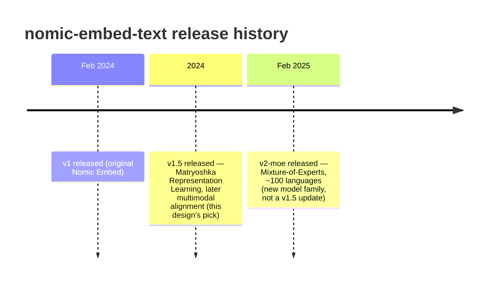

# nomic-embed-text-v1.5: what it is, how it compares, and what it costs to run

This page is a deeper look at the specific model this design proposes ([PROPOSAL.md](PROPOSAL.md)), for the "why this model, not something else" question. Sourced from Nomic's published model card/technical report and current comparisons, not just general familiarity with the model — cited below.

## What it is

- **Architecture:** a BERT-base-sized encoder, 137M parameters, ~274MB on disk at fp16. Not a decoder/generative model — it produces one fixed-size vector per input text, in a single forward pass (no token-by-token generation), which is why embedding is cheap relative to anything LLM-generation-shaped.
- **Output dimensions:** 768 natively, but trained with **Matryoshka Representation Learning** — the model explicitly learns nested representations, so the output vector can be truncated to any size from 64 up to 768 (including a binary-embedding mode) with only a small, predictable quality loss, rather than needing a separately-trained smaller model. This is a real lever if payload/storage size ever becomes a constraint in this design — see "What this means for the Marco project" below.
- **Context window:** 8,192 tokens — long by open-embedding-model standards (most competitors top out around 512). Not usually the binding constraint for a single ~30-second transcript chunk, but relevant if show notes or an "episode identity" chunk end up longer.
- **Prompt convention:** trained asymmetrically for retrieval — text must be prefixed with `"search_document: "` when embedded for storage or `"search_query: "` when embedded as a search query. This is a training-time convention baked into the model, not a client-side formatting nicety — [already called out in PROPOSAL.md](PROPOSAL.md) as a correctness requirement, restated here because it's a property of *this specific model*, not a general embedding-model pattern.
- **Training:** contrastive pretraining, released with model weights, training code, and training data all public — Nomic's stated goal was a fully *reproducible* embedder, in contrast to most competitors that publish weights but not the training pipeline behind them.

Sources: [Nomic Embed technical report](https://static.nomic.ai/reports/2024_Nomic_Embed_Text_Technical_Report.pdf), [Hugging Face model card](https://huggingface.co/nomic-ai/nomic-embed-text-v1.5), [Nomic's Matryoshka announcement](https://www.nomic.ai/news/nomic-embed-matryoshka)

## How it compares to alternatives

| Model | Params | Dims (native) | Context | MTEB (v1 board, English) | Open weights + training data + code? | Notes |
|---|---|---|---|---|---|---|
| **nomic-embed-text-v1.5** | 137M | 768 (Matryoshka 64–768) | 8,192 tokens | ~62.3–62.4 | **Yes, fully** (weights, data, training code) | This design's pick — see rationale below |
| OpenAI `text-embedding-3-small` | undisclosed | 1536 (configurable) | 8,191 tokens | ~62 | No — API-only, closed weights | nomic-embed-text-v1.5 outperforms it at matched dimensions; irrelevant here anyway since it requires a network call, ruling it out for offline/on-device use |
| BGE-large-en-v1.5 | 335M | 1024 | 512 tokens | ~63–65 | Weights yes, training data/code not fully open | Slightly higher MTEB, but 2.4x the parameters and a much shorter context window; heavier for an on-device model |
| GTE-large-en-v1.5 | 434M | 1024 | 8,192 tokens | ~63–65 | Weights yes, training pipeline not fully open | Competitive quality and matches the long context, but 3x the parameters — more RAM/compute for a marginal quality gain, worse fit for battery-constrained iOS inference |
| e5-mistral-7b-instruct | 7B | 4096 | 32,768 tokens | higher (top-tier) | Weights yes | An LLM repurposed as an embedder — 50x the parameters of nomic-embed-text-v1.5. Meaningfully better quality but not remotely a fit for a phone; not a serious candidate here |
| nomic-embed-text-v2-moe | 475M total / 305M active | 768 (Matryoshka to 256) | — | competitive with larger models, multilingual | Yes, fully open (same philosophy as v1.5) | Nomic's newer model (Feb 2025) — Mixture-of-Experts, ~100 languages. Bigger footprint and MoE routing adds inference complexity for a marginal gain that's mostly about multilingual coverage, which this project likely doesn't need |

**Why v1.5 specifically, not v2-moe or a larger model:** this project's bottleneck isn't retrieval quality in the abstract — a 62-ish MTEB score is already well past "good enough to catch paraphrase matches FTS5 misses," which is the actual bar (see PROPOSAL.md's FTS5 comparison). The bottleneck is running on a phone, on battery, within a Siri intent's execution budget, and staying small enough that shipping it as a bundled app asset is reasonable. On every axis that matters here — parameter count, disk size, inference cost, mobile-framework compatibility (BERT-style architecture, well-supported in both MLX and Core ML conversion tooling) — v1.5 is the better fit than the larger or multilingual-MoE alternatives, and it's still fully open under the same permissive license.

## Does Apple have a competing on-device model? (`NLContextualEmbedding`, Foundation Models, "Golden Gate")

Worth untangling three different things here, since they get conflated easily:

**"Golden Gate" isn't a model — it's the codename for macOS 27**, announced at WWDC 2026 (like "Sonoma" or "Sequoia" before it). It's an OS release, not an AI model or framework. Nothing to evaluate here as a nomic-embed-text competitor; it's just where the frameworks below happen to ship.

**Apple's Foundation Models framework** (introduced WWDC 2025, expanded WWDC 2026) gives apps direct access to the on-device LLM behind Apple Intelligence — a 3B-parameter model on iOS 26+/current macOS, now with image input and a hybrid on-device/Private Cloud Compute/third-party-model routing layer as of WWDC 2026. This is a **generative** model (text in, text out, tool-calling, guided generation) — it doesn't expose a public embedding-vector API. It's not a competitor to nomic-embed-text-v1.5 for this design's purpose; it's a different capability (better suited to, say, generating the natural-language Siri response text in the App Intents feature, not to producing the vectors that power the search itself).

**`NLContextualEmbedding`** (Apple's `NaturalLanguage` framework, iOS 17+/current macOS) is the real candidate — and it's the same one already in production use in a related project: `NotesMCP`'s Spotlight `semantic_rank` feature (`sources/shared/nl_embedder.py`) uses this exact API today, specifically *because* it needs no Ollama/no bundled model.

### Head-to-head: nomic-embed-text-v1.5 vs. `NLContextualEmbedding`

| | `nomic-embed-text-v1.5` | `NLContextualEmbedding` |
|---|---|---|
| What it is | A specific, versioned open-weight model you bundle | An OS-provided API — no model to bundle, ship, or convert |
| Dependency footprint | Third-party model weights + `mlx-swift`/Core ML + tokenizer (see ownership table) | **Zero** — it's a system framework call, like `Accelerate` |
| Output dimensions | 768, consistently, on every platform (farm and client identical) | **768 on macOS, 512 on iOS/tvOS/watchOS — platform-dependent** |
| Cross-platform vector compatibility | Farm (macOS) and client (iOS) produce directly comparable vectors | Farm and client would produce **different-sized, incompatible vectors** from the same API — a real problem for this architecture's farm-embeds-once/client-compares model |
| Retrieval-specific training | Explicit asymmetric `"search_query: "` / `"search_document: "` prefix training, documented and benchmarked for retrieval | No documented retrieval-specific (query-vs-document) training; positioned as a general on-device text-understanding primitive, not a retrieval-tuned embedder |
| Published retrieval quality | MTEB ~62.3–62.4, publicly benchmarked, reproducible | **No published benchmark** — quality for this specific use case (short query vs. transcript-chunk retrieval) is genuinely unmeasured, not just unmeasured-by-us |
| Sentence/chunk-level output | Returns one pooled vector per input natively | Unclear from available documentation — some sources describe per-token contextual vectors requiring the caller to pool; at least one source describes whole-string sentence-level output. **Not confirmed either way here — verify against Apple's current API docs before relying on it**; either way it's a minor implementation detail, not a blocking one |
| Version control | Pin to a specific Hugging Face commit hash — you control exactly which weights run, forever | Tied to the OS version — Apple can change the underlying model in an OS update with no version bump the app can pin against or detect explicitly |
| Language coverage | Primarily English-tuned (v1.5); multilingual is the separate v2-moe model | Three script-family models (Latin/20 languages, Cyrillic, CJK), auto-selected — broader out-of-the-box multilingual coverage if that's ever needed |
| License / commercial terms | Apache 2.0 — explicit, auditable | N/A — not a licensable artifact, it's an OS capability; no license question at all |
| Minimum OS | Runtime-dependent — Core ML back to iOS 11-ish, or `mlx-swift`'s iOS 18 floor if MLX is used client-side (see the platform-compatibility notes) | iOS 17+ / current macOS |

**Net take:** `NLContextualEmbedding` wins decisively on dependency footprint — it's the one item in the ownership table that would disappear entirely, not just move to a friendlier license. But the **768-vs-512 cross-platform dimension mismatch** and the **absence of any published retrieval benchmark** are specific, concrete problems for *this* design, not abstract caution — this project's whole mechanism depends on farm and client producing comparable vectors, and on retrieval quality being good enough to beat FTS5 on paraphrase matches. Both are unknowns with `NLContextualEmbedding` that are knowns with `nomic-embed-text-v1.5`. Worth an empirical side-by-side before ruling it out, but `nomic-embed-text-v1.5` stays the documented default here.

### Any announced improvements to `NLContextualEmbedding` for macOS 27 / iOS 27?

**No evidence of any.** Searching Apple's WWDC 2026 session list and current developer documentation turns up nothing specific to `NLContextualEmbedding` for this cycle — the on-device-AI attention at WWDC 2026 went to the Foundation Models framework (image input, hybrid on-device/Private Cloud Compute/third-party-model routing) and App Intents' new "Assistant Schemas" for deeper Siri integration (see the platform-compatibility notes). `NLContextualEmbedding` appears unchanged since its iOS 17 introduction, at least as far as public documentation and session content show. Absence of an announcement isn't proof nothing changed internally, but there's nothing to point to that would alter the comparison above.

**Where this leaves the choice:** `NLContextualEmbedding` is a legitimate on-device alternative worth prototyping — it eliminates model bundling, licensing, and the mlx-embeddings/coremltools conversion pipeline entirely, since it's just an OS API call with no external dependency at all (the one item in the ownership table that would move from "third-party" to "not a dependency, it's the OS"). But the platform-dependent dimension mismatch (768 macOS vs. 512 iOS) and the unknown/unbenchmarked retrieval quality are real, not cosmetic, problems for *this specific design*, where farm and client must produce comparable vectors and relevance quality is the whole point of the feature. `nomic-embed-text-v1.5` stays the better default given known, published retrieval performance and a version you can pin — but this is worth a cheap empirical side-by-side (e.g. run both on a handful of real transcript chunks + queries, compare which surfaces the right chunk more often) rather than a purely theoretical decision, precisely because `NLContextualEmbedding` would remove a meaningful slice of this design's third-party dependency surface if its quality turns out to be good enough.

**Sources:**
- [Apple Developer: `NLContextualEmbedding`](https://developer.apple.com/documentation/naturallanguage/nlcontextualembedding) — Apple's primary API reference (dimensions, availability)
- [On-Device Text Embeddings in React Native with Apple NLP framework — Callstack](https://www.callstack.com/blog/on-device-ai-introducing-apple-embeddings-in-react-native) — 512-dim iOS/watchOS/tvOS vs. 768-dim macOS, script-family model breakdown
- [`buh/NaturalLanguageEmbeddings` — GitHub](https://github.com/buh/NaturalLanguageEmbeddings) and [Embeddings — React Native AI docs](https://www.react-native-ai.dev/docs/apple/embeddings) — describe per-token output requiring pooling (conflicts with the dev.to source below — flagged as unconfirmed in the table above rather than silently picking one)
- [WWDC25: iOS 26's Revolutionary Multilingual Enhancements — dev.to](https://dev.to/arshtechpro/wwdc-2025-ios-26s-revolutionary-multilingual-enhancements-2fp2) — describes whole-string sentence-level output (the conflicting claim, noted above)
- [Foundation Models framework overview — WWDC26 developer guide](https://developer.apple.com/wwdc26/guides/apple-intelligence/) and [What's new in the Foundation Models framework — WWDC26 session video](https://developer.apple.com/videos/play/wwdc2026/241/) — confirms 2026 on-device-AI announcements centered on Foundation Models/App Schemas, nothing `NLContextualEmbedding`-specific
- [macOS Golden Gate overview — MacRumors](https://www.macrumors.com/roundup/macos-27/) — confirms "Golden Gate" is the macOS 27 codename, not a model
- [Monkeybread Software: `NLContextualEmbeddingMBS` class reference](https://www.monkeybreadsoftware.net/class-nlcontextualembeddingmbs.shtml) — model size (under 100MB per script family), Neural Engine optimization note

## Update cadence / versioning

Nomic ships new embedding models on the order of **roughly annually, not continuously** — this is a versioned model release, not a live/rolling model like a hosted API that changes under you:

- **v1**: released February 2024 (original Nomic Embed).
- **v1.5**: followed shortly after, adding Matryoshka Representation Learning and later multimodal alignment (a paired `nomic-embed-vision-v1.5` sharing the same embedding space). This is the version this design targets.
- **v2-moe**: released February 2025 — a materially different architecture (Mixture-of-Experts, multilingual), not an in-place update to v1.5. Confirms Nomic's pattern: new capability tiers ship as new model names, not silent version bumps to an existing one.

Practical implication: **pin to a specific Hugging Face commit/revision hash of `nomic-embed-text-v1.5`**, not just the model name, and treat any move to a newer model (v2-moe or whatever comes after) as a deliberate, coordinated re-index — every existing chunk embedding, farm-side and already-synced to clients, becomes incompatible with a new model's vector space. This isn't a hypothetical: it's the same category of hazard as the tokenizer-parity issue already flagged in PROPOSAL.md, just at the "which model" level instead of "which runtime" level.

Sources: [Hugging Face model card](https://huggingface.co/nomic-ai/nomic-embed-text-v1.5), [Nomic Embed Text V2 announcement](https://simonwillison.net/2025/Feb/12/nomic-embed-text-v2/), [arXiv: Training Sparse Mixture Of Experts Text Embedding Models](https://arxiv.org/abs/2502.07972)

## License model

**Apache 2.0 — weights, training code, and training data are all released under it.** Practically:

- Free for commercial use, no royalty, no revenue-share, no "contact us for a commercial license" tier (unlike some open-weight models that use non-commercial or field-of-use-restricted licenses).
- Only real obligation is standard Apache 2.0 boilerplate — preserve the license/copyright notice if redistributing the model itself. Doesn't impose anything on Marco's own app code (Apache 2.0 is permissive, not copyleft).
- Same license as `nomic-embed-text-v2-moe`, `swift-transformers`, and — per the ownership table in [PROPOSAL.md](PROPOSAL.md#is-this-fully-open-source-whats-not-code-marco-owns) — the least restrictive tier among this project's third-party dependencies (contrast with `mlx-embeddings`' GPLv3, which is a build-tool-only dependency for exactly this reason).

Sources: [`nomic-ai/nomic-embed-text-v1.5` — Hugging Face](https://huggingface.co/nomic-ai/nomic-embed-text-v1.5) (license field, Apache-2.0), [`nomic-ai/nomic-embed-text-v1.5-GGUF` — Hugging Face](https://huggingface.co/nomic-ai/nomic-embed-text-v1.5-GGUF) (mirrors the same license)

## How long does chunking + embedding a 2-hour transcript take on an M4?

Honest answer up front: **there's no published benchmark for this exact combination** (nomic-embed-text-v1.5, via `mlx-swift`, on an M4 Mac Mini specifically) — this is a reasoned estimate from the closest available numbers, not a measured one. Treat it as a planning estimate to validate with an actual benchmark once `ChunkAndEmbed.swift` is wired up to real MLX calls (cheap to do — a few minutes running it against one real episode).

**Working the numbers:**

1. **Transcript size for a 2-hour episode:** conversational podcasts run roughly 150–170 words/minute → a 2-hour episode is **~18,000–20,000 words**, call it ~24,000–26,000 tokens after WordPiece tokenization (word-to-token ratio of ~1.3 for English).
2. **Chunk count:** at this design's ~320-character chunking target (see PROPOSAL.md's "Chunking" section), that's roughly **~240–300 chunks** for a 2-hour episode — consistent with the ~120 chunks/hour figure already used elsewhere in the proposal for payload-size estimates.
3. **Total tokens actually run through the model:** each chunk is independently embedded (plus the `"search_document: "` prefix, +3 tokens), and the one-sentence overlap between chunks means slightly more total tokens are embedded than exist in the raw transcript — call it **~28,000–32,000 tokens of embedding work** per 2-hour episode.
4. **Closest available throughput reference:** one published data point (via Ollama, not MLX, on an **M2 Max**, batched at 128) reports **~9,340 tokens/sec** for nomic-embed-text. That's a GPU-bound, encoder-only workload — architecturally the same shape MLX would run, just a different serving stack and a higher-end chip (M2 Max has far more GPU cores than a base M4).
5. **Scaling down to a base M4 Mac Mini:** a base M4 has meaningfully fewer GPU cores than an M2 Max (single-digit vs. 30+), so even accounting for M4's newer architecture and per-core efficiency gains, a conservative scaling factor is roughly 5–10x lower raw throughput than the M2 Max figure — call it **~1,000–2,000 tokens/sec** as a planning range for a base M4.

**Putting it together:** ~30,000 tokens ÷ ~1,000–2,000 tokens/sec ≈ **roughly 15–30 seconds of embedding compute for one 2-hour episode's worth of chunks**, on a base M4. Chunking itself (sentence splitting, timestamp bookkeeping — no model involved) is plain string processing and negligible by comparison, well under a second.

**Context that matters more than the precise number:** whatever this actually measures out to, it's dwarfed by the transcription step it runs right after — transcribing 2 hours of audio takes meaningfully longer than tens of seconds, even with an efficient on-device model. Embedding is very unlikely to be the bottleneck in the farm pipeline; if it does turn out to matter at 40-Mac-Mini scale (thousands of episodes/day), the fix is unremarkable — batch multiple chunks per model call rather than one-at-a-time (the M2 Max figure above is *already* a batched number, batch size 128, which is most of why it's as fast as it is), not a model or architecture change.

Sources: [Best Ollama Embedding Models 2026 (M2 Max throughput figure)](https://www.morphllm.com/ollama-embedding-models), [nomic-embed-text model card](https://huggingface.co/nomic-ai/nomic-embed-text-v1.5), podcast word-count-per-minute figures from [wordcountertool.net](https://www.wordcountertool.net/word-count/for/podcast-script) and [speakingtimecalculator.org](https://speakingtimecalculator.org/blog/podcast-script-timing-words-to-minutes)
