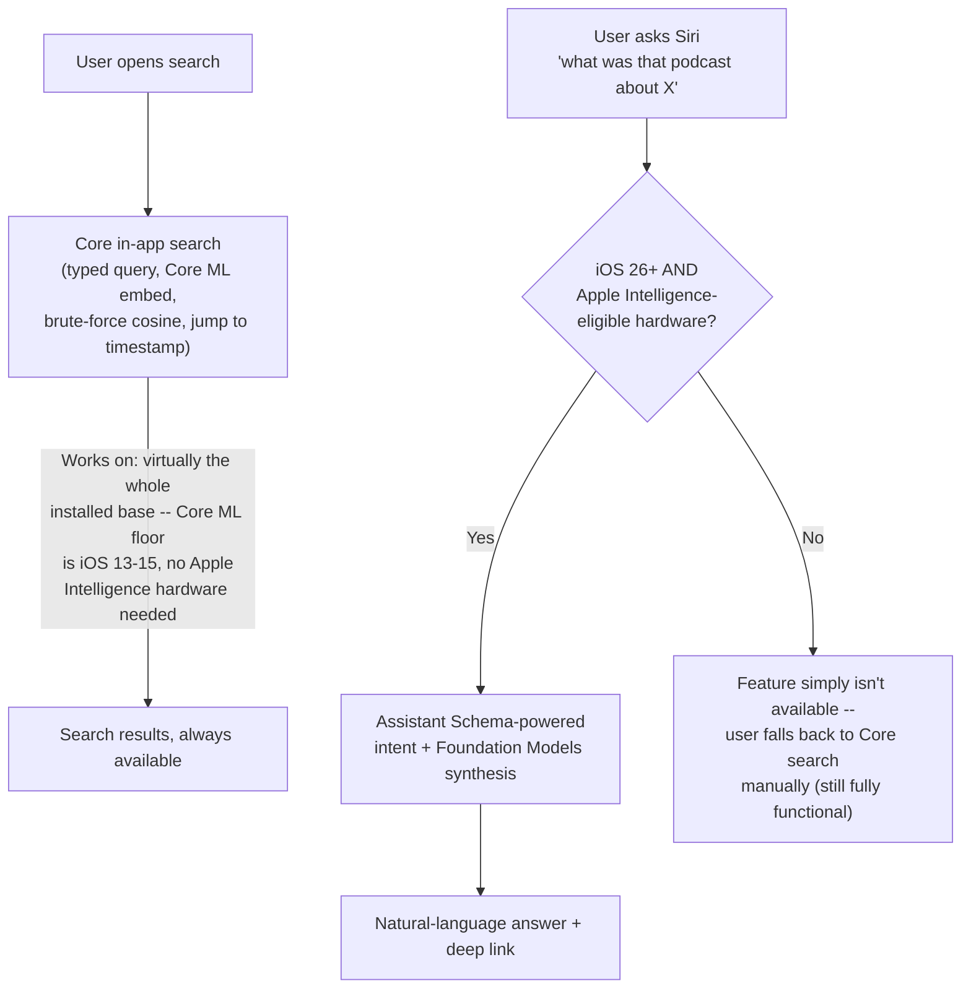

# iOS 27 opportunities, and backward compatibility

Two related questions: what new-generation platform capabilities are worth building into this design, and what's the actual minimum iOS version story once you do.

## New iOS 27 / current-platform capabilities worth using

### 1. App Intents "Assistant Schemas" — directly strengthens the Siri feature already in the roadmap

iOS 27 (WWDC 2026) pushes Siri toward being "more capable, more contextual, more personal," with a new **Assistant Schemas** layer on top of App Intents specifically for richer Siri/Apple Intelligence integration, and cross-device chat history. This isn't a new idea for this design — it's validation of, and the concrete API surface for, the `FindEpisodeByTopicIntent` feature already proposed in [PROPOSAL.md's feature roadmap](PROPOSAL.md#5-siri--app-intents-integration--what-was-that-podcast-about-x). Conforming the episode `AppEntity` and the search intent to an Assistant Schema (rather than a plain custom `AppIntent`) is what unlocks Siri's more natural-language, context-aware invocation of it, versus the more rigid fixed-phrase Shortcuts-style invocation basic App Intents have had since iOS 16.

**Sources:** [WWDC26: Build intelligent Siri experiences with App Schemas](https://developer.apple.com/videos/play/wwdc2026/240/), [Creating App Intents using Assistant Schemas — Create with Swift](https://www.createwithswift.com/creating-app-intents-using-assistant-schemas/), [Apple Newsroom: Apple unveils next generation of Apple Intelligence, Siri, and more](https://www.apple.com/newsroom/2026/06/apple-unveils-next-generation-of-apple-intelligence-siri-ai-and-more/)

### 2. Foundation Models framework — a natural on-device RAG layer on top of what's already designed

Apple's Foundation Models framework (introduced WWDC 2025, expanded WWDC 2026 with image input and hybrid on-device/Private Cloud Compute/third-party-model routing) gives apps a 3B-parameter **generative** on-device LLM. It's not an embedding model (see [NOMIC_EMBED.md](NOMIC_EMBED.md) — it was ruled out as a nomic-embed-text competitor for exactly that reason), but it composes naturally with what this design already does:

- The retrieval step (nomic-embed-text + brute-force cosine) finds the *right chunks* — fast, cheap, already fully designed.
- Foundation Models can turn those chunks into a **synthesized natural-language answer**, not just a ranked list — e.g. instead of "here's the closest-matching 30-second segment," an answer like "they discussed this in two places: first around 14 minutes when the host asked about X, and again near the end when the guest circled back to it." This is the standard on-device RAG pattern (retrieve locally, synthesize locally), and both halves are already fully offline in this design, so adding a synthesis layer doesn't change any of the offline/privacy/no-server-cost properties already established — it's additive, not a new dependency category.
- Directly useful for the Siri feature's dialog response, too: rather than hand-assembling the "That was Show Name — Episode Title..." string from metadata + one matched chunk (as currently sketched), Foundation Models could generate a more natural summary across the top-k matches.

Worth prototyping as a v2 addition once the core retrieval mechanism is validated — it's a strict layer on top, not a redesign.

**Sources:** [WWDC26 Apple Intelligence developer guide](https://developer.apple.com/wwdc26/guides/apple-intelligence/), [What's new in the Foundation Models framework — WWDC26](https://developer.apple.com/videos/play/wwdc2026/241/), [WWDC 2026: Apple's Foundation Models Become a Hybrid AI Platform — Appbot](https://appbot.co/blog/apple-wwdc-2026-ai-foundation-model-update/)

### 3. SpeechAnalyzer / SpeechTranscriber — a possible client-side fallback, not a farm replacement

iOS 26 introduced `SpeechAnalyzer`/`SpeechTranscriber`, a new on-device speech-to-text framework reported to run roughly 2x faster than Whisper Large V3 Turbo on equivalent transcription tasks, plus a `SpeechDetector` module for voice-activity detection. This **doesn't change the farm-side design** — the "transcribe once, share many times" economics (PROPOSAL.md's opening constraint) are still strictly better than any client doing its own transcription, so this shouldn't replace the Mac Mini farm pipeline. Where it could help: an episode that's brand new (just published, not yet processed by the farm) or a live/breaking episode could get **instant local transcription client-side** as a stopgap — search and chunking work immediately on-device, and once the farm's canonical transcript+chunks sync down, they'd replace the local stopgap version. This is a genuine v2+ idea, not something this design depends on; flagging it because it's new this cycle and specifically relevant to a podcast app's "just published" freshness problem.

**Sources:** [Apple's New Transcription APIs Blow Past Whisper in Speed Tests — MacRumors](https://www.macrumors.com/2025/06/18/apple-transcription-api-faster-than-whisper/), [Bring Advanced Speech-to-Text to Your App with SpeechAnalyzer — Level Up Coding](https://levelup.gitconnected.com/bring-advanced-speech-to-text-to-your-app-with-speechanalyzer-6ed25a84586c), [On-Device Speech Transcription with Apple SpeechAnalyzer — Callstack](https://www.callstack.com/blog/on-device-speech-transcription-with-apple-speechanalyzer)

## Is this design backward compatible? What iOS versions does it actually require?

Short answer: **the core search feature has a low floor; the Siri/AI layers on top have a much higher one — and that split is exactly the graceful-degradation story you want.** Every component has a different minimum version, so the honest answer is "it depends which piece":

| Component | Minimum OS | Notes |
|---|---|---|
| SQLite + FTS5, `Accelerate`/`vDSP` | No meaningful floor | Already true of the app today, unchanged |
| Core ML (recommended client runtime, Option B) | Core ML 3 → iOS 13; ML Program format → iOS 15 | ANE dispatch (`.cpuAndNeuralEngine`) available broadly; works in the Simulator too (CPU fallback), unlike MLX |
| `mlx-swift` (only relevant under Option A, MLX-everywhere) | **iOS 18** | **Requires a physical Apple Silicon device — does not run in the iOS Simulator at all.** A real testing/CI cost, and another concrete reason Option B (Core ML on iOS) is the better fit, beyond the power/latency argument already made in PROPOSAL.md |
| Basic App Intents (Shortcuts/Spotlight invocation) | iOS 16 | The floor for *some* Siri-adjacent discoverability, even without the richer layer below |
| App Intents Assistant Schemas (natural-language Siri, the feature as designed) | iOS 26 | Plus **Apple Intelligence-eligible hardware** — see below, this is the real constraint, not the iOS version alone |
| Foundation Models framework (RAG synthesis idea above) | iOS 26 | Same Apple Intelligence hardware requirement |
| `SpeechAnalyzer`/`SpeechTranscriber` (client-side fallback idea above) | iOS 26, no backward compatibility at all | On-device only, no server-side path either |

**The hardware gate matters as much as the iOS version.** Apple Intelligence itself (which the richer Siri/Assistant Schemas layer and Foundation Models both depend on) requires **A17 Pro or later** and **8GB+ RAM** — that's iPhone 15 Pro/15 Pro Max and all iPhone 16+ models, plus M1+ iPads and M-series Macs. iOS 27 itself installs on iPhone 11 and newer, but a meaningful slice of devices that *can run iOS 27* still **cannot run Apple Intelligence features** at all, regardless of iOS version. So "does this need iOS 27" and "does this need Apple Intelligence" are two different gates, and the design needs to handle both correctly, not conflate them.

**Practical implication:** ship the core search mechanism (Options B's Core ML client path, brute-force cosine, SQLite storage) as the baseline feature — it works on essentially the whole active install base with no Apple Intelligence dependency at all. Gate the Siri/Assistant-Schema entry point and any Foundation-Models-based answer synthesis behind an availability check (`SystemLanguageModel.availability` for Foundation Models, and the standard Apple-Intelligence-eligibility check for Assistant Schemas) and treat them as pure enhancements. A user on an iPhone 12 running iOS 27 gets full in-app search and none of the Siri magic; a user on an iPhone 16 Pro gets both. Nothing about the core mechanism should require gating on Apple Intelligence eligibility — that's a design choice this proposal makes deliberately, not an accident of what happened to be available.

**Sources:** [iOS 27: Everything We Know — MacRumors](https://www.macrumors.com/roundup/ios-27/), [Apple Newsroom: Apple unveils next generation of Apple Intelligence, Siri, and more](https://www.apple.com/newsroom/2026/06/apple-unveils-next-generation-of-apple-intelligence-siri-ai-and-more/), [Apple Intelligence Supported Devices — TechPP](https://techpp.com/2026/04/01/apple-intelligence-supported-devices/), [Core ML vs MLX: Apple's Two ML Frameworks Compared — Cactus](https://cactuscompute.com/compare/coreml-vs-mlx) (MLX iOS 18 floor, Simulator limitation), [From Video to Voiceover in Seconds: Running MLX Swift on ARM-Based iOS Devices](https://dev.to/yooi/from-video-to-voiceover-in-seconds-running-mlx-swift-on-arm-based-ios-devices-1md9) (MLX Simulator/device requirement), [coremltools neural-network conversion docs](https://coremltools.readme.io/v6.3/docs/neural-network-conversion) (Core ML version/iOS floor history)
