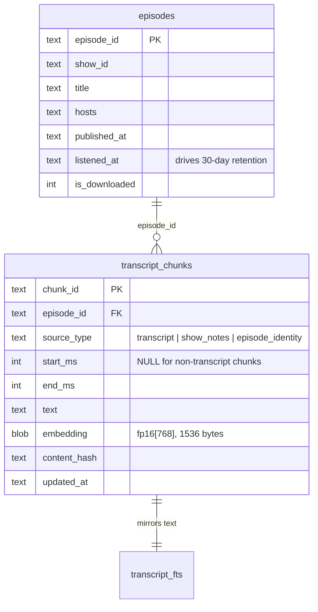
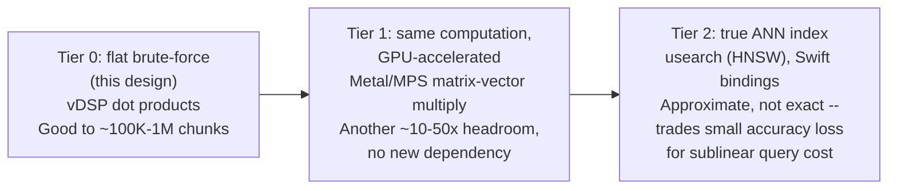
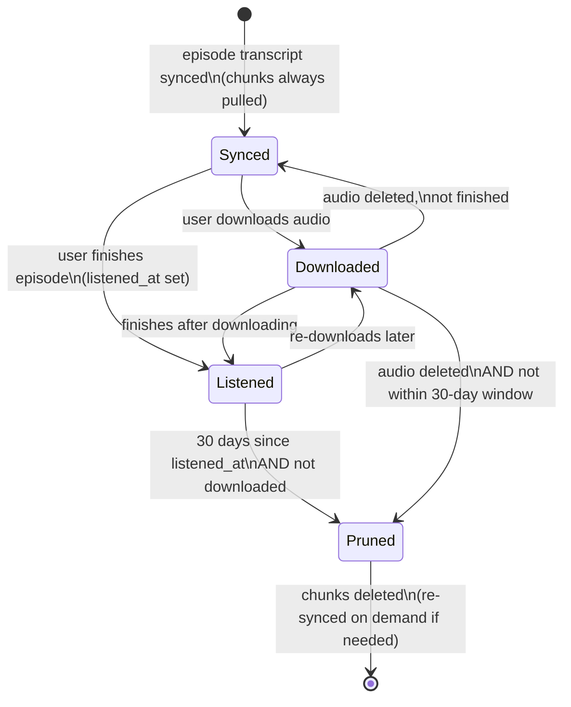
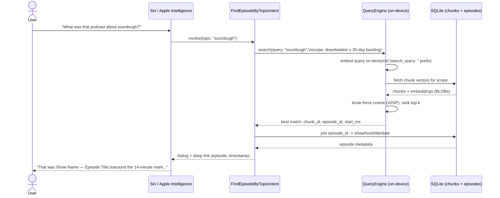
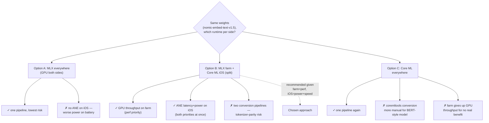
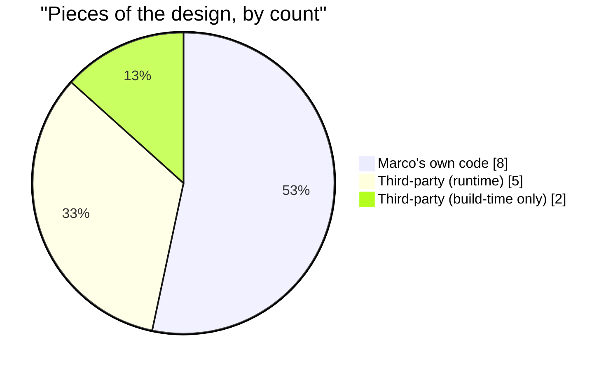

# Offline Semantic Search for Podcast Transcripts

## The constraint that shapes everything

Marco's app already has two things worth protecting:

1. **Transcribe once, serve many** — 40 M4 Mac Minis transcribe each episode a single time; every listener gets the same transcript. Any search feature should preserve this economics: don't do per-user or per-query server work.
2. **A lightweight SQLite-backed client** — no vector DB, no server extension, no new persistence layer. Whatever search index the client needs has to fit in the storage and query patterns SQLite already supports (plain tables, BLOB columns, linear scans).

That rules out a hosted vector-search service (defeats offline + adds per-query server cost) and rules out swapping in `sqlite-vec` or similar (extra native dependency, cross-compilation for iOS, and a new moving part in the client). It leaves: **compute the expensive part once, on the farm, and ship a small enough result that the client can brute-force it.**

This is the standard shape for hybrid keyword+vector search — chunk + embed once, store vectors, compare at query time — adapted for a client that has to do the query-side embedding itself, fully offline, rather than calling out to a server-side embedding process. That's the one new capability this design requires: an on-device model small enough to run in an app.

## Architecture

```mermaid
flowchart LR
    subgraph farm ["Mac Mini farm — per episode, once"]
        direction TB
        A1["1. Transcribe\n(existing pipeline)"] --> A2["2. Chunk transcript\n(sentence / time-windowed)"]
        A2 --> A3["3. Embed each chunk\n(MLX, nomic-embed-text)"]
        A3 --> A4["4. Quantize (fp16) +\nattach to sync payload"]
        A4 --> A5["5. Serve via existing\ndistribution path"]
    end

    subgraph client ["iOS client — per query, offline"]
        direction TB
        B1["1. Sync pulls new/changed\nchunks (incremental, cursor)"] --> B2["2. Store chunks + fp16\nvectors as BLOBs in SQLite"]
        B2 --> B3["3. On search: embed query\non-device ('search_query: ' prefix)"]
        B3 --> B4["4. Brute-force cosine vs.\nstored vectors (Accelerate/vDSP)"]
        B4 --> B5["5. Rank, jump to\nchunk's timestamp"]
    end

    A5 -.->|sync payload| B1
```



Nothing server-side changes per-query — embedding happens once at transcription time and is amortized across every listener, same as transcription itself. Nothing client-side needs a new storage engine — chunks and vectors ride in tables next to whatever SQLite schema already holds transcripts.

## Why not just SQLite FTS5?

SQLite already ships FTS5 on iOS for free — no dependency, no new code. Worth being direct about what it does and doesn't get you, since this design adds real complexity (a farm-side embedding step, an on-device model) on top of something that already exists.

**What FTS5 is:** a keyword/token index. It matches on the words actually present in the text (with stemming/prefix support), ranked by term frequency (BM25). It's exact-vocabulary matching — fast, zero-dependency, and genuinely good at what it does.

**What FTS5 structurally cannot do:** match on *meaning* when the words differ. A user who searches "sourdough starter dying" will not find the segment where the guest says "my culture kept going flat and smelling like nail polish remover" — there's no shared vocabulary for FTS5 to index against, no matter how the query is stemmed or tokenized. This isn't a tuning problem, it's what token-matching search is. Podcast transcripts are conversational speech, not written prose with consistent terminology — the same topic gets described differently by different guests, in asides, in answer-the-question-without-restating-it style. That's exactly the gap embedding-based search closes: it compares the *meaning* of the query against the *meaning* of each chunk, not the literal tokens.

**Concretely, what this buys over FTS5 alone:**

| | FTS5 alone | + embeddings (this design) |
|---|---|---|
| Exact term / name / jargon match | Yes, and fast | Also yes — the design keeps FTS5 alongside embeddings, not instead of it |
| Paraphrase / conceptual match ("the part about burnout" finds "I was so exhausted I couldn't get out of bed") | No | Yes |
| Ranking by relevance to intent, not just term frequency | No — BM25 only knows term stats | Yes — cosine similarity reflects semantic closeness |
| Works when the user doesn't remember the exact phrase used | No | Yes — this is the common real case for "find that part where..." |

**This design doesn't replace FTS5 — it adds semantic recall on top of it.** The client schema keeps the `transcript_fts` virtual table (see below) specifically so exact-term search stays free and fast; embeddings handle the harder case FTS5 can't reach at all. A production version would likely blend both (hybrid ranking — combine FTS5's exact-match hits with embedding-similarity hits, rather than picking one) — but even embeddings alone already cover a real, common search failure mode that no amount of FTS5 tuning fixes, because the problem isn't ranking, it's that the words genuinely don't match.

## 1. Chunking (server, once per episode)

Chunk by sentence boundaries within a target window (e.g. 200–400 characters, ~20–45 seconds of speech), not fixed token counts — transcript segments already carry word/phrase-level timestamps from the transcription step, so each chunk can carry a `(start_time, end_time)` pair for free. That's what lets a search hit jump straight to the right moment in playback, which is the actual product feature — text search is a means to "find the part where they talked about X."

Keep a small overlap (one sentence) between consecutive chunks so a topic mentioned right at a chunk boundary isn't split across two low-scoring halves.

## 2. Embedding (server, once per episode)

Use an MLX port of `nomic-embed-text-v1.5` (see [NOMIC_EMBED.md](NOMIC_EMBED.md) for why this model specifically — comparison to alternatives including Apple's own on-device `NLContextualEmbedding`, license, update cadence, and estimated M4 embedding throughput):

- Check `mlx-community` on Hugging Face for an existing converted checkpoint first.
- Otherwise, convert from `nomic-ai/nomic-embed-text-v1.5` HF safetensors using `mlx-embeddings`.
- 768 dimensions, fp16 storage (not fp32) — halves payload size with negligible cosine-similarity accuracy loss. Quantizing further to int8 is possible but adds a dequantization step on both ends for a smaller win than fp16 already gets you; not worth it until payload size is a proven problem.
- **Nomic's prompt-prefix convention must be preserved exactly**: chunks are embedded with the `"search_document: "` prefix, queries with `"search_query: "`. This isn't cosmetic — nomic-embed-text was trained asymmetrically for retrieval, and getting the prefix wrong (or inconsistent between server and client) will silently degrade relevance without throwing an error. This is a correctness requirement, not a tuning knob.
- Tokenizer must match exactly between server (whatever converts the HF checkpoint) and client (`swift-transformers`' WordPiece tokenizer). Mismatched tokenization is a much more common and much harder-to-diagnose failure mode than quantization drift — cosine similarity tolerates numeric drift fine; it does not tolerate two different token streams being embedded as if they were the same text.

This step runs on the same Mac Minis right after transcription, using the same "on-device model, no cloud cost" philosophy already proven out for transcription.

**No harness/daemon process is involved — this is a direct library call, not a server.** A tool like Ollama, by contrast, wraps its model in a long-running process that exposes a REST API on `localhost:11434`; a caller has to spawn/supervise that process and talk to it over HTTP, even for local calls, and manage that subprocess's lifecycle (start it, keep it alive, shut it down cleanly on exit). MLX has no equivalent — it's an array/ML framework, imported like any other library.

Marco's farm pipeline is Swift end to end, which simplifies this further: the same worker process that already does transcription and chunking links against `mlx-swift` directly (`import MLX` / `import MLXNN`), loads the converted `nomic-embed-text-v1.5` weights into memory once at process startup, and calls the model as an ordinary in-process function — `embed(text: String) -> [Float]` — inline with the chunking step, in the same language, same binary, same process. No subprocess to spawn, no port to manage, no HTTP round-trip even to itself, and no cross-language boundary between transcription/chunking and embedding either — it's all one Swift call stack. This is exactly what `server-sample/ChunkAndEmbed.swift` sketches (the `Embedder` enum's `import MLX` / `import MLXNN` placeholders are where the real `mlx-swift` calls go).

The one non-Swift piece stays firmly outside this runtime: converting the HF checkpoint to an MLX-compatible weight file is a one-time, offline step (via `mlx-embeddings`, a Python tool — see the licensing note above) run once by a person on a build machine, not by the farm at transcription time. Its Python-ness never touches the Swift service; it just produces a weights file that `mlx-swift` loads.

## 3. Payload format

Extend the existing transcript sync payload with a `chunks` array — no new distribution channel:

```json
{
  "episode_id": "abc123",
  "transcript_version": 3,
  "chunks": [
    {
      "chunk_id": "abc123-0042",
      "start_ms": 812400,
      "end_ms": 838900,
      "text": "...",
      "embedding": "<base64 fp16[768]>",
      "content_hash": "sha256:...",
      "updated_at": "2026-08-01T12:00:00Z"
    }
  ]
}
```

- `embedding`: base64-encoded fp16 array — 768 × 2 bytes = 1536 bytes/chunk. A one-hour episode chunked at ~30s/chunk is ~120 chunks ≈ 180KB of embedding data, alongside text that's already being shipped.
- `content_hash` + `updated_at`: reuse whatever change-detection the server already does for transcript indexing, so sync can be **incremental** — client requests "chunks changed since cursor X," not a full re-pull. This matters more for corrections/re-transcriptions than for new episodes, but it's the same mechanism either way.

## 4. Client storage (SQLite, unchanged engine)

Two new tables, no new extension. `source_type` and nullable timestamps accommodate show-notes and episode-identity chunks alongside transcript chunks (see "Feature roadmap" below); `episodes` is not new storage — it's whatever table already backs the app's library UI, shown here only to make the join explicit:



```sql
CREATE TABLE transcript_chunks (
    chunk_id      TEXT PRIMARY KEY,
    episode_id    TEXT NOT NULL,
    source_type   TEXT NOT NULL DEFAULT 'transcript',
    start_ms      INTEGER,        -- NULL for show_notes/episode_identity chunks
    end_ms        INTEGER,
    text          TEXT NOT NULL,
    embedding     BLOB NOT NULL,   -- fp16[768], 1536 bytes
    content_hash  TEXT NOT NULL,
    updated_at    TEXT NOT NULL
);
CREATE INDEX idx_chunks_episode ON transcript_chunks(episode_id);

-- optional: free keyword search using iOS's bundled SQLite FTS5
CREATE VIRTUAL TABLE transcript_fts USING fts5(text, content='transcript_chunks', content_rowid='rowid');
```

FTS5 ships in iOS's SQLite already — a keyword-match fallback/complement costs nothing extra to add and is worth it as a hybrid signal (exact term match catches names/jargon that embeddings sometimes blur).

## 5. On-device query

1. Embed the query text on-device, `"search_query: "` prefix, fp16 output — via Core ML on iOS per the recommended split (Option B, see "Neural Engine vs. GPU" below); the farm's MLX model and the client's Core ML model must be conversions of the *same* `nomic-embed-text-v1.5` weights so the vector spaces match.
2. `SELECT chunk_id, embedding FROM transcript_chunks WHERE episode_id = ?` (or `WHERE episode_id IN (downloaded_ids)` for cross-episode search) — a normal SQLite read, embeddings come back as BLOBs.
3. Brute-force cosine similarity in Swift using `Accelerate`/`vDSP` batched dot products. No ANN index needed:
   - Single episode: a few hundred chunks — sub-millisecond.
   - Cross-episode over a user's downloaded/kept library: even at tens of thousands of chunks, flat fp16/fp32 cosine via `vDSP` is single-digit milliseconds — brute force comfortably covers personal-scale corpora. See "How far does brute force scale?" below for the actual numbers behind that claim and what comes next if it's ever outgrown.
4. Rank top-k, return `(chunk_id, score, start_ms)`, jump playback to `start_ms`.

### How far does brute force scale?

Worth being concrete rather than hand-wavy about this, since "brute force is fine" is doing a lot of work in the design above.

**The single-episode search tier never has a scaling question at all.** A chunk count of a few hundred per episode is fixed by the chunking design (PROPOSAL.md's "Chunking" section) — it doesn't grow with library size, listening history, or anything else. Brute force is the permanent answer there, not a stage in an evolution.

**The scaling question only applies to the cross-episode tier**, bounded by "downloaded + 30-day listened backlog" (the retention design above). Working the actual compute cost:

- Cosine similarity over N chunks is N dot products of length 768 — roughly `2 × N × 768` floating-point operations (multiply-add pairs), plus a norm per chunk if not precomputed.
- **Cheap optimization worth doing before ever reaching for an index:** store chunk embeddings pre-normalized (L2 norm = 1) at write time. Cosine similarity between two unit vectors is just their dot product — no per-query norm computation needed at all, and it's a one-line change to `ChunkAndEmbed.swift`'s output step, not new infrastructure.
- Apple's `Accelerate` framework (`vDSP`/BLAS-backed, using NEON/AMX where available) sustains multiple GFLOPS on a single core for exactly this kind of batched dot-product workload. At a conservative few GFLOPS: **100,000 chunks ≈ 150M FLOPs ≈ tens of milliseconds; 1,000,000 chunks ≈ 1.5B FLOPs ≈ a few hundred milliseconds.**
- **Translating chunk counts into something concrete:** at ~120 chunks/hour of audio (used elsewhere in this doc for payload-size estimates), 100,000 chunks is **~830 hours of retained transcript** — roughly 400–800 typical episodes' worth, held *simultaneously* in the cross-episode index. Given the retention design actually bounds this to "downloaded + finished in the last 30 days," even a very heavy listener (3+ hours/day, every day) accumulates on the order of **~90 hours ≈ 10,000 chunks** in that 30-day window — an order of magnitude below where brute force even starts to feel slow. **Under this design's own retention rules, a real user is unlikely to ever approach the range where brute force becomes a problem** — this isn't "fine for now," it's fine by construction, as long as retention stays bounded the way it's designed.

That said, if the design changes later (e.g. unbounded whole-library-forever retention, or a "search everything I've ever listened to" mode), here's the actual evolution path, in order of how much new complexity each step costs:



- **Tier 1 — move the same brute-force computation to the GPU**, before reaching for an approximate index at all. A matrix-vector multiply (all chunk vectors × one query vector) parallelizes naturally across GPU threads via Metal Performance Shaders (`MPSMatrix`) or a small custom compute shader — likely another 10–50x throughput over CPU `vDSP` for the exact same, still-exact result. This is a step people often skip past straight to an ANN index, but it's strictly simpler (no new index structure to build/maintain, no approximation) and pushes the "brute force is fine" ceiling up by roughly an order of magnitude before any accuracy tradeoff is needed.
- **Tier 2 — `usearch`** (mentioned as the fallback earlier in this project's design discussions) if a corpus genuinely outgrows even GPU brute force — realistically only relevant at very high hundreds of thousands to millions of chunks. It's the better fit here than `sqlite-vec` specifically because of this design's "don't touch SQLite" constraint (see "The constraint that shapes everything" above): `usearch` has native Swift bindings and builds its index structure *from* vectors that stay exactly where they already are — plain BLOBs in `transcript_chunks` — rather than requiring a SQLite extension to be cross-compiled and loaded into the client's database engine. The tradeoff to weigh if this tier is ever reached: HNSW-style indexes are approximate (a small, tunable chance of missing the true nearest neighbor in exchange for sublinear query cost) and carry their own memory overhead for the graph structure, on top of the raw vectors.

## Search scope: two tiers, one mechanism

- **Within an episode** (always available): scan is trivial, no storage concern — every synced episode's chunks are already local.
- **Across a user's library** (opt-in, bounded): only keep chunk embeddings for episodes the user has downloaded or explicitly kept. This bounds `transcript_chunks` growth to something a user already chose to store locally (they already accepted the audio file's disk cost, which dwarfs 1536 bytes/chunk). Evict a downloaded episode's audio → evict its chunks in the same pass. No separate storage budget to design — it rides on the existing download/retention lifecycle.

Once the 30-day listened backlog (feature 4 below) is added, a chunk's lifecycle has three independent ways to stay alive and one way to die:



Chunks are kept as long as an episode is **downloaded** *or* **within 30 days of being finished** — either condition alone is enough. They're only pruned once both lapse.

## Feature roadmap

Five extensions worth designing for now, even if not all ship in v1 — each is a natural fit for this architecture rather than a bolt-on, because the expensive work (chunking, embedding) already happens once on the farm and the client already does a flat scan over whatever chunks it has locally. Adding more chunks, or chunks with richer metadata, doesn't change the mechanism — it just changes what's in the table.

### 1–2. Single-episode and cross-episode (on-device) search

Already the core of the design above — restated here only to place them at the front of the roadmap, since everything else in this list is additive to these two.

### 3. Show notes as a second, complementary index

Most podcast feeds carry show notes (RSS `<description>`/`<content:encoded>`) — episode summary, guest bio, links, timestamps the host wrote themselves. That's often *higher-signal* than the transcript for "what was this episode about," and it's usually already available wherever the app currently ingests the RSS feed, no new data source needed.

- Chunk and embed show notes through the exact same farm pipeline as transcripts (same model, same `"search_document: "` prefix), tagged with a `source_type` so client-side ranking/display can distinguish "found in the show notes" from "found at 14:32 in the transcript."
- Show notes are typically short (a paragraph to a few hundred words) — often one or two chunks per episode, negligible added payload size compared to a full transcript's worth of chunks.
- Falls back cleanly when a feed doesn't provide show notes: no show-notes chunks for that episode, transcript search still works, nothing breaks.

### 4. 30-day searchable backlog for listened episodes

Right now chunk retention is tied to *audio* retention — delete the downloaded audio, delete its chunks. That's the right default for storage-bounded cross-episode search, but it creates a real gap: a user often deletes an episode's audio right after finishing it (that's the normal listening lifecycle), yet a week later remembers a topic from it and wants to find it. If chunks were evicted with the audio, that episode is now unsearchable — exactly the case Siri-based recall (below) needs to *not* fail.

The fix: decouple chunk/text retention from audio retention specifically for episodes the user has *finished listening to*. Track a `listened_at` timestamp per episode (the app already knows this for playback-position/completion purposes) and keep that episode's chunks — text and embeddings only, not audio — for 30 days after `listened_at`, independent of whether the audio file itself is still on disk. This is cheap to justify: a chunk is ~1.5KB of embedding plus a sentence or two of text; even a heavy listener finishing a few episodes a day for 30 days is a few hundred KB to a few MB total, nothing close to what one episode's audio file costs. A daily prune job deletes chunk rows where `listened_at < now - 30 days` (and the episode isn't otherwise downloaded/kept, which has its own retention).

### 5. Siri / App Intents integration — "what was that podcast about X?"

This is the feature the other four are really in service of, and it's also why the whole design being **on-device and offline** matters rather than being a nice property: an App Intent that Siri/Apple Intelligence can invoke has to answer without a network round-trip, within a tight execution budget, and works even when the app isn't in the foreground. A server round-trip per query would be a poor fit here in a way it wouldn't be for a normal in-app search bar. The brute-force cosine scan already designed above (sub-millisecond to low-single-digit milliseconds) comfortably fits that budget; a network call would not.

Concretely, using Apple's App Intents framework:

- Define an `AppEntity` for a podcast episode (show name, episode title, hosts, published date, episode artwork) — this is the metadata piece from item 6 below, surfaced through Siri results and Spotlight for free once it exists as a proper entity type.
- Define an intent (e.g. `FindEpisodeByTopicIntent`) taking a free-text topic parameter, backed by the same `QueryEngine.search`/`searchLibrary` mechanism already in `client-sample/QueryEngine.swift` — the intent handler is a thin wrapper, not new search logic.
- Search scope for the intent should be the union of "currently downloaded/kept" and the "30-day listened backlog" from item 4 — Siri is disproportionately likely to be asked about something the user *just* finished listening to and already deleted, which is exactly the gap item 4 closes.
- Response: a natural-language dialog response ("That was **Show Name** — *Episode Title*, from **Sept 3** — around the 14-minute mark, the host and **Guest Name** were talking about...") plus a deep link that opens the app to that timestamp. The dialog text is assembled from the episode metadata entity + the matched chunk's text/timestamp, not generated by the embedding model itself — the embedding step only finds *which* chunk is relevant, the metadata join produces the human-readable answer.



No step in this flow leaves the device — the whole path from query to answer is local, which is what keeps it within a Siri intent's execution budget and working offline.

### 6. Show/host/date metadata in the index

For both ranking quality and for the Siri use case above to produce a sensible answer, every chunk needs to resolve back to rich episode metadata, not just an opaque `episode_id`: show name, host name(s), episode title, published date, and (if useful) episode-level tags/category from the feed. This shouldn't be duplicated into `transcript_chunks` — it almost certainly already lives in whatever `episodes`/`shows` tables the app's existing SQLite schema has for its normal library UI. `transcript_chunks.episode_id` is the join key; the search layer joins out to that existing metadata table when assembling a result, rather than this design inventing a second copy of show/episode data.

One thing worth deciding explicitly: whether to *also* embed a small "episode identity" pseudo-chunk (show name + host + title + date, concatenated) alongside the transcript/show-notes chunks. That helps a query like "that show hosted by X" or "the episode from last week" match on metadata terms the transcript itself may never say aloud — hosts rarely introduce themselves mid-episode. Cheap to add (one extra chunk per episode) and closes a real gap between "search the content" and "search what the episode *is*."

## Neural Engine vs. GPU: MLX doesn't get you there

Marco's ask, reasonably: use the M4's Neural Engine (ANE) for embedding, both on the Mac Mini farm and on iOS devices, for speed and power efficiency. Worth being precise here, because MLX doesn't deliver this:

- **MLX targets the GPU** (via Metal), not the ANE. It's excellent for the farm side — the Mac Minis are plugged in, GPU throughput is the right optimization target, and MLX's ease of loading/converting HF checkpoints is a real advantage there. But "MLX embedding" and "Neural Engine embedding" are not the same thing, on macOS or iOS.
- **Core ML is the only Apple framework that dispatches to the ANE**, and even then indirectly — Core ML's scheduler picks CPU/GPU/ANE per-op at runtime based on the model graph, memory pressure, and what's already running; you request `.all` compute units and it decides, not you.
- Battery-powered iOS is exactly where ANE matters most (perf/watt is the whole point on a phone doing search while the user is also playing audio). The Mac Mini farm is plugged into wall power, so ANE there is a nice-to-have for thermals/rack density, not a requirement — GPU throughput via MLX is a fine choice for the farm regardless of what the client does.

Only one framework can reach the ANE at all — Core ML. MLX (and PyTorch/TensorFlow-Metal) can only reach CPU or GPU. So "use MLX" and "use the Neural Engine" are mutually exclusive choices, not two knobs on the same framework. That leaves three real options:

**Source:** [Core ML vs MLX: Apple's Two ML Frameworks Compared — Cactus](https://cactuscompute.com/compare/coreml-vs-mlx) — confirms MLX dispatches only to CPU/GPU via Metal, while Core ML is the only framework path to the ANE, with `MLComputeUnits` controlling CPU/GPU/ANE dispatch.



### Option A — MLX everywhere (GPU, both sides)

- **Pros:** one runtime, one conversion pipeline, one thing to keep numerically consistent. `mlx-embeddings` is the most mature path for pulling `nomic-embed-text-v1.5` off Hugging Face today. Least engineering risk.
- **Cons:** no ANE utilization anywhere. On the farm this barely matters (wall power, GPU throughput is already the right target). On iOS it means embedding a query burns GPU cycles instead of the much more power-efficient ANE — worse for battery life on exactly the device where that's supposed to matter.
- **When it's the right call:** if "Neural Engine" was really shorthand for "fast and efficient," not a hard requirement, and query embedding turns out to be cheap enough on GPU that the difference is unmeasurable in practice (plausible — it's a few hundred tokens through a small encoder, likely sub-50ms either way).

### Option B — MLX on the farm, Core ML on iOS (split runtime)

- **Pros:** gets ANE on the device where perf/watt actually matters (phone, on-battery, possibly running while audio is also playing), while keeping the farm on MLX's easier conversion tooling.
- **Cons:** two separate model-conversion pipelines from the same source weights (`mlx-embeddings` for the farm, `coremltools` for the client). That's two chances to introduce a subtle preprocessing mismatch — tokenizer differences, prefix handling, normalization — between server and client. This is the failure mode called out below: it degrades relevance silently, no crash, just worse search results that are hard to root-cause.
- **Mitigation:** a small golden-set test — same 20–30 strings, assert token-id sequences match exactly between whatever tokenizes for MLX and whatever tokenizes for Core ML — run once, before trusting any relevance numbers. Not expensive, just easy to skip and then regret.
- **When it's the right call:** if ANE on iOS is a real product requirement (battery life claims, thermal budget while podcast + search running concurrently), not just "would be nice."

### Option C — Core ML everywhere

- **Pros:** single runtime again, ANE-eligible on both sides (the farm's M4s have ANE too — Core ML's scheduler could use it there as well, though with less benefit than on iOS since power isn't constrained).
- **Cons:** Core ML's HF-to-CoreML conversion tooling (`coremltools`) is less turnkey for a BERT-style embedding model than MLX's path — expect more manual work getting `nomic-embed-text-v1.5` converted and validated. Also, Core ML doesn't let you force ANE — you request `.cpuAndNeuralEngine` and its scheduler decides per-op at runtime based on the graph and what else is running; for a model architecture with unsupported ops it can silently fall back to CPU/GPU with no error.
- **When it's the right call:** if consistency (one pipeline, no cross-runtime drift risk) is valued over conversion ease, and someone's willing to do the more manual Core ML conversion work up front.

### Recommendation

Given the stated priorities — raw performance on the Mac Mini farm, with power and search speed weighted equally on iOS — **Option B is the clear call, not just the pragmatic middle ground:**

- **Farm: performance is the only priority, so GPU-via-MLX is the right target, full stop.** Chunk embedding on the farm is a bulk, batched workload (whole episodes, many chunks at once, no user waiting on a single result) — exactly the profile where GPU throughput wins over ANE. The ANE is optimized for low-latency, low-power *single* inferences, not batch throughput; pushing the farm toward Core ML/ANE would trade away the thing that's actually prioritized there for a benefit (power efficiency) that isn't a farm priority given wall power.
- **iOS: power and speed are weighted equally, and that's not actually a tension for this specific workload — it's a case for ANE, not against it.** Query-time embedding on iOS is the opposite profile from the farm: a single short string (a few hundred tokens), one inference, need the answer as fast as possible without draining the battery. That is precisely the workload Core ML's ANE path is designed for — low latency *and* low power on small single-inference requests, not a tradeoff between the two. GPU-via-MLX would likely be competitive on latency for a workload this small, but it burns more power doing it; since power is an equal-weight priority here (not secondary), that's a real cost, not a rounding error.

So the split in Option B isn't a compromise between two runtimes with different strengths — it's each side independently landing on the runtime that matches its own priority: GPU/MLX for farm throughput, ANE/Core ML for iOS latency-and-power together. The mitigation above (tokenizer-parity golden-set test) is the cost of that split and should be budgeted up front rather than treated as optional, given both sides are now firm requirements rather than one being a "nice to have."

**Practical implication for the architecture either way:** the two sides don't have to use the same runtime, as long as they produce numerically-equivalent embeddings from the same underlying weights. Swapping runtimes only changes the client sample's `QueryEmbedder` implementation (Core ML `MLModel` instead of an MLX graph) — chunk storage, the sync payload, and the brute-force cosine search are all runtime-agnostic, since they only care about the final float vector, not what produced it. The one hazard that applies regardless of which option is chosen: tokenizer parity and the `"search_document: "`/`"search_query: "` prefix convention must match exactly across whichever two runtimes end up on each side.

## What this deliberately does not do

- No vector DB, no SQLite extension, no ANN index. Brute-force is fast enough at this scale and keeps the client dependency surface unchanged.
- No per-query server cost. Embedding happens once per chunk, server-side, amortized like transcription already is.
- No new sync channel. Chunks + embeddings ride the existing transcript payload/sync path with incremental cursors.

## Is this fully open source? What's not code Marco owns?

**Yes — every piece of this, end to end, is either open source or a free Apple system framework already on the device. No commercial software, no paid API, no license fee anywhere in the pipeline.** But "open source" and "code you own" aren't the same thing — everything below is a third-party dependency of one kind or another, even where it costs nothing. Worth listing plainly, since Marco prefers to limit third-party dependencies and should know exactly what's being taken on and where.

Worth stating plainly since it's a common assumption for local-model setups: **this design does not use Ollama anywhere.** Ollama is a macOS-only always-on daemon; it can't run on iOS, so it was never a candidate for the client side, and MLX/Core ML replace it on the farm side too (see "Neural Engine vs. GPU" above). The only thing this design borrows from that model-serving family of tools is the same *model weights* (`nomic-embed-text`) — served through a completely different, iOS-compatible runtime.

### Every piece, owned vs. third-party



| Piece | What it is | Owned by Marco? |
|---|---|---|
| Chunker (sentence/time-windowed segmentation) | His code, farm side | **Yes — his code** |
| Embedder wrapper (prefix handling, calls into MLX) | His code, farm side | **Yes — his code** |
| Payload builder (chunks → sync payload JSON) | His code, farm side | **Yes — his code** |
| Sync/cursor logic (incremental pull, content-hash diffing) | His code, both sides | **Yes — his code** |
| SQLite schema (`transcript_chunks`, `episodes` join, FTS5 virtual table) | His schema, client side | **Yes — his schema** |
| Storage layer (insert/upsert/prune, `SearchIndexStore`) | His code, client side | **Yes — his code** |
| Query engine (brute-force cosine ranking, `QueryEngine`) | His code, client side | **Yes — his code** |
| App Intents (`FindEpisodeByTopicIntent`, episode `AppEntity`, dialog assembly) | His code, client side | **Yes — his code** |
| SQLite + FTS5 | Storage, keyword search | No — OS-bundled, public domain |
| Accelerate / vDSP | Cosine similarity math | No — OS-bundled, Apple system framework |
| Core ML | ANE-eligible inference (Option B/C) | No — OS-bundled, Apple system framework |
| MLX / MLX Swift | GPU inference, model loading | No — third-party Swift package (MIT) |
| `swift-transformers` (Hugging Face) | WordPiece tokenizer, client side | No — third-party Swift package (Apache-2.0) |
| `nomic-embed-text-v1.5` weights | The embedding model itself | No — third-party model weights (Apache-2.0) |
| `mlx-embeddings` (community) | HF → MLX weight conversion | No — third-party tool (GPLv3), build-time only |
| `coremltools` (Apple) | HF → Core ML weight conversion | No — third-party tool (BSD-3), build-time only |

**The short version: every line of logic that actually implements this feature — chunking, embedding orchestration, sync, storage, ranking, and the Siri-facing App Intents — is code Marco writes and owns outright.** The third-party surface is entirely underlying *infrastructure* (a tokenizer, a model's weights, a math library, an inference runtime) that any on-device ML feature would need from somewhere — none of it is the feature itself, and none of it is behind a paywall or commercial license.

| Component | Role | License | Owned by Marco? | Shipped at runtime? |
|---|---|---|---|---|
| SQLite + FTS5 | Storage, keyword search | Public domain | No — OS-bundled | Yes, client (already true today, unchanged) |
| Accelerate / vDSP | Cosine similarity math | Apple system framework (proprietary, free) | No — OS-bundled | Yes, client |
| Core ML | ANE-eligible inference (Option B/C) | Apple system framework (proprietary, free) | No — OS-bundled | Yes, client |
| MLX / MLX Swift | GPU inference, model loading | MIT (open source) | No — third-party Swift package | Yes, farm (both options); client only under Option A |
| `swift-transformers` (Hugging Face) | WordPiece tokenizer, client side | Apache-2.0 (open source) | No — third-party Swift package | Yes, client |
| `nomic-embed-text-v1.5` weights | The embedding model itself | Apache-2.0 (open source) | No — third-party model weights | Yes, both sides (as a bundled model file, not code) |
| `mlx-embeddings` (community, Prince Canuma) | HF → MLX weight conversion | **GPLv3** | No — third-party tool | No — build/conversion-time only, not linked into anything shipped |
| `coremltools` (Apple) | HF → Core ML weight conversion (Option B/C) | BSD-3-Clause (open source) | No — third-party tool | No — build/conversion-time only |

Two things worth flagging directly:

- **Everything actually shipped at runtime (client app or farm service) is either public-domain, MIT, Apache-2.0, or an Apple system framework that's already part of the OS.** No AGPL, no viral copyleft, nothing that imposes obligations on Marco's own app code.
- **The one license worth a second look is `mlx-embeddings`, which is GPLv3** — a copyleft license, stricter than everything else in this list. It's only used as an offline conversion tool (HF checkpoint → MLX format), run once on a build machine, never linked into the farm service or the iOS app — that's generally the kind of use GPL's copyleft terms don't reach (no distribution of GPL-covered code, no linking into a distributed binary), but "generally" isn't a substitute for Marco actually confirming that reading holds for how he'd use it, especially given the stated preference to limit third-party dependencies in the first place. The cleaner alternative: check `mlx-community` on Hugging Face for an *already-converted* `nomic-embed-text-v1.5` MLX checkpoint first (mentioned above under "Embedding") — if one exists, `mlx-embeddings` isn't needed at all, and the GPL question disappears entirely rather than needing to be reasoned about.

**Sources for the license table above:**
- [`nomic-ai/nomic-embed-text-v1.5` — Hugging Face](https://huggingface.co/nomic-ai/nomic-embed-text-v1.5) — Apache-2.0
- [`ml-explore/mlx-swift` — GitHub](https://github.com/ml-explore/mlx-swift) (MIT LICENSE file) — MLX/MLX Swift
- [`huggingface/swift-transformers` — GitHub](https://github.com/huggingface/swift-transformers/blob/main/LICENSE) — Apache-2.0
- [`Blaizzy/mlx-embeddings` — GitHub](https://github.com/Blaizzy/mlx-embeddings) — GPLv3
- [`apple/coremltools` — GitHub](https://github.com/apple/coremltools) — BSD-3-Clause

## Open questions / next steps

- Confirm an `mlx-community` nomic-embed-text checkpoint exists for the farm side, or budget time for the `mlx-embeddings` conversion + quantization pass.
- MLX Swift needs a BERT-style encoder (nomic-embed-text's architecture) — likely adapted from existing MLX Swift examples rather than written from scratch.
- Separately, convert the same `nomic-embed-text-v1.5` weights to Core ML via `coremltools` for the client (Option B's recommended runtime — see "Neural Engine vs. GPU" above); this is a second, independent conversion pipeline from the farm's MLX one and needs its own validation pass.
- Validate tokenizer parity **across both conversions** — MLX Swift's tokenizer vs. `swift-transformers`' WordPiece tokenizer feeding the Core ML model — with a golden set of (text → token ids) pairs before trusting any relevance numbers. This is the single most important validation step given the farm and client now deliberately run different runtimes.
- Decide chunk window size empirically against a few real transcripts — 200–400 chars is a starting point, not a measured optimum.

See [server-sample/](../server-sample) and [client-sample/](../client-sample) for illustrative (not production-ready) code sketches of the chunk+embed step and the client store/query engine, [NOMIC_EMBED.md](NOMIC_EMBED.md) for the embedding model deep dive, and [PLATFORM_COMPATIBILITY.md](PLATFORM_COMPATIBILITY.md) for iOS 27 opportunities and minimum-iOS-version compatibility.
